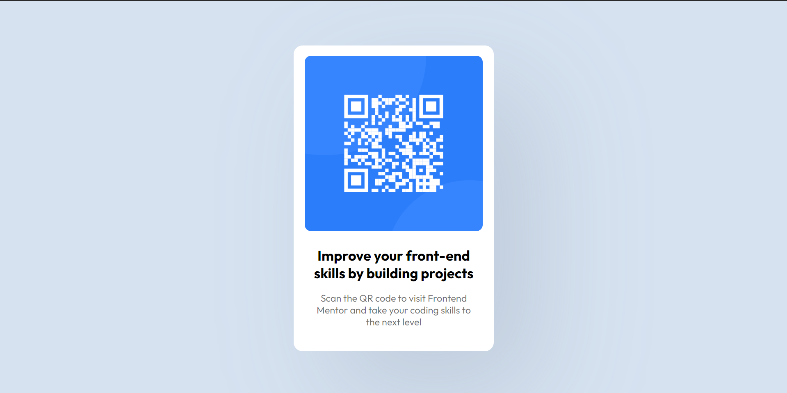

# Frontend Mentor - QR code component solution

Essa é a minha solução do [QR code component challenge no Frontend Mentor](https://www.frontendmentor.io/challenges/qr-code-component-iux_sIO_H)

## Sumário

- [O desafio](#the-challenge)
- [Capturas de tela](#screenshot)
- [Desenvolvido com](#built-with)
- [Autor](#author)

### O desafio

O desafio era desenvolver esse componente de QR code e deixá-lo o mais próximo possível do design.

### Screenshots

Este é o design oficial:

- 
- 

Esta é a minha solução: 

- 
- 

### Desenvolvido com:
- HTML5
- CSS3
- Flexbox

## Author
- Github - [Bruno Martins](https://github.com/3runoAM)
- Frontend Mentor - [@3runoAM](https://www.frontendmentor.io/profile/3runoAM)